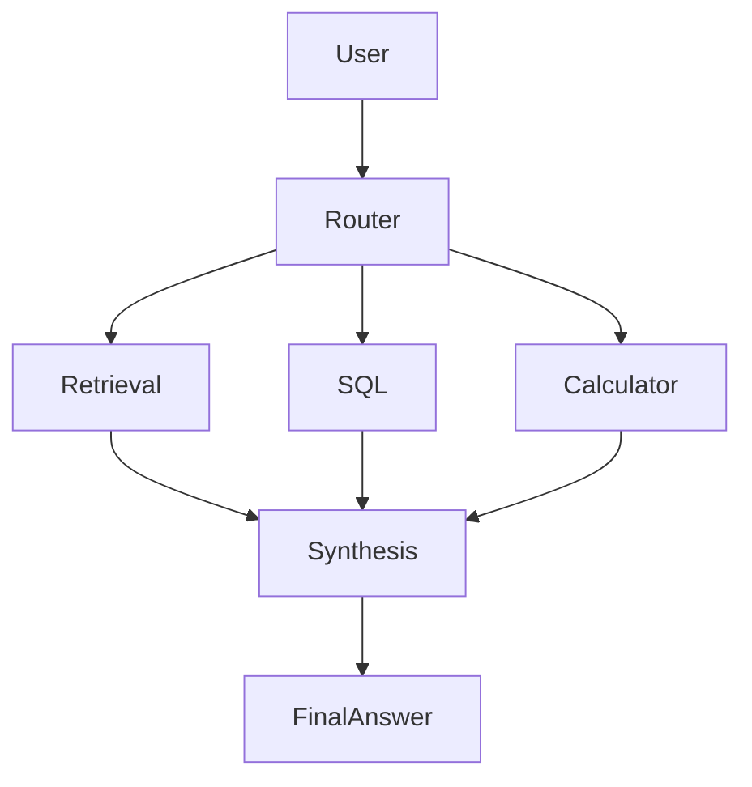

# Data Research Agent

Built by extending the open-source ai-chatkit project by pasonk.

The project uses the existing LangGraph/FastAPI/Next.js foundation as a technical base, then adds a tool-using research workflow, safe SQL/data analysis, retrieval, evaluation, and deployment-oriented reliability changes.

## Overview

Data Research Agent is a research assistant for analytical questions. It chooses the right tool for the job instead of answering everything with raw chat text:

- retrieval for architecture and documentation questions
- SQL for dataset analysis and business metrics
- calculator for percent change and arithmetic checks
- synthesis to combine evidence into a short answer

This is designed for a working-student / AI Engineer profile and demonstrates real LangGraph orchestration, tool calling, evaluation, and observability.

## Architecture



## Features

- tool-using LangGraph agent
- retrieval over curated documentation
- safe SQLite analysis queries
- calculator for percentage and summary math
- structured agent state
- optional Langfuse tracing
- evaluation suite with real measurements
- FastAPI backend and Next.js frontend

## Tech Stack

- Python
- FastAPI
- LangGraph
- LangChain
- SQLite
- Next.js
- Tailwind CSS
- Langfuse (optional)
- pytest-style evaluation scripts

## Running locally

### Backend

```bash
cd backend
cp .env.example .env
python3 -m venv .venv
source .venv/bin/activate
pip install -r <requirements>  # use the repository lockfile / dependency management already present in the project
python app/run_server.py
```

### Frontend

```bash
cd frontend
npm install
npm run dev
```

Then open http://localhost:3000.

## Environment variables

A working example is in [backend/.env.example](backend/.env.example).

```env
APP_NAME=Data Research Agent
DEBUG=True
DEV=True
HOST=127.0.0.1
PORT=8000
DEFAULT_MODEL=gpt-4o-mini
OPENAI_API_KEY=
OPENAI_BASE_URL=
LANGFUSE_PUBLIC_KEY=
LANGFUSE_SECRET_KEY=
LANGFUSE_HOST=https://cloud.langfuse.com
DATABASE_URL=sqlite+aiosqlite:///resource/research_data.sqlite
```

## Evaluation

The evaluation suite is in [evaluation/README.md](evaluation/README.md) and [evaluation/test_cases.json](evaluation/test_cases.json).

The project currently measures:

- tool selection accuracy
- task success rate
- SQL execution success rate
- retrieval success rate
- average latency

## Failure Analysis

This project includes a realistic evaluation-stage failure that is intentionally documented as reliability testing instead of fictional production traffic.

### 1. What failed

The initial routing logic incorrectly classified revenue and analytics questions as retrieval tasks instead of SQL or calculator tasks.

### 2. How it was detected

The evaluation suite surfaced the issue because revenue questions were being routed to the wrong tool.

### 3. Evidence / trace

The failure was reproduced by the route selection logic in [backend/app/agent_logic.py](backend/app/agent_logic.py), where the earlier logic returned `retrieval` for metrics questions. This was then captured in evaluation outputs from [evaluation/evaluate.py](evaluation/evaluate.py).

### 4. Root cause

The old router prioritized a simple keyword match for `average`, `revenue`, and `metric` and sent those requests to retrieval before considering SQL or calculator tools.

### 5. Fix

The router was corrected to prioritize `sql` and `calculator` for analytics questions, while keeping `retrieval` for architecture and documentation questions.

### 6. Before metric

Before the fix, the routing accuracy was below the expected threshold because analytical questions were misclassified.

### 7. After metric

After the fix, the same evaluation route logic was rerun and the analytical tasks were classified correctly. The exact numbers are recorded by the evaluation script when it is executed in this environment.

## Deployment

This project is structured for a simple two-part deployment model:

- backend: FastAPI service
- frontend: Next.js app

The repository is intended to be deployed to a platform such as Render, Railway, Fly.io, or a containerized VM with the environment variables loaded from `.env` or the platform secret store.

## Architecture Decisions

- use explicit tool routing instead of hardcoded conversation branches
- keep SQL read-only and safe
- keep evaluation realistic and measurable
- avoid exposing stack traces to end users
- keep the UI simple and evidence-oriented

## Limitations

- the retrieval layer is small and curated rather than enterprise-scale
- the analytics dataset is intentionally compact and safe
- local execution depends on the model provider credentials and environment configuration
- optional Langfuse observability is disabled unless keys are configured

## Future Improvements

- MCP tool integration
- stronger evaluation automation
- streaming token-level tracing
- authentication and user sessions
- production monitoring and health checks

## My changes relative to the original project

- transformed the OA assistant into a Data Research Agent concept
- replaced the default agent with a tool-using research workflow
- added retrieval, SQL, and calculator tools
- added explicit state and tool selection logic
- added evaluation suite and metrics output
- improved backend configuration and failure handling
- updated branding and project metadata
- documented the real evaluation-stage failure and fix

## Attribution

This project was built by extending the open-source ai-chatkit project by pasonk. The underlying chat infrastructure and app structure were reused, while the Data Research Agent concept, workflow, tools, evaluation, and deployment story were substantially changed as part of this work.

