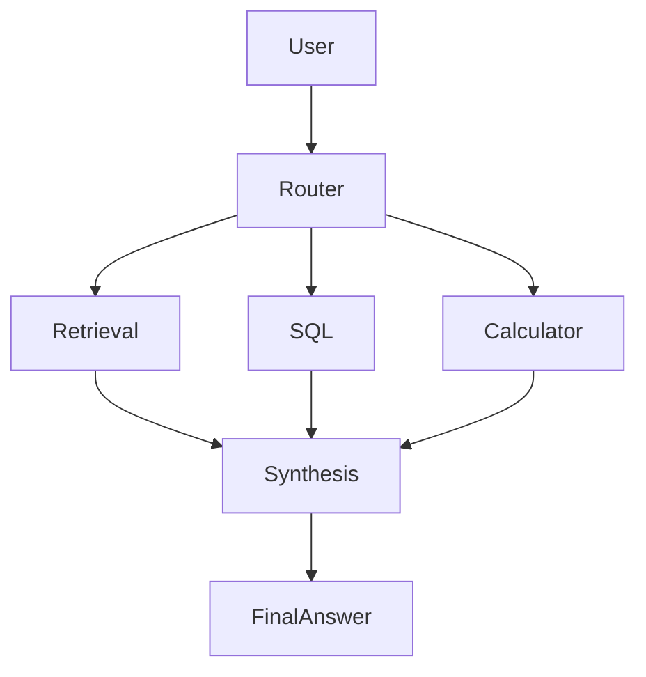

# Data Research Agent

A tool-using research agent that answers analytical questions by picking the right tool for the job — retrieval, SQL, or a calculator — instead of routing everything through one generic chat response. Built by extending the open-source ai-chatkit project by pasonk as a base, with the routing logic, tools, and evaluation suite below layered on top.

## What it does

- **Retrieval** — answers architecture/documentation questions from a small curated knowledge base
- **SQL** — answers dataset and business-metric questions against a local SQLite dataset, with destructive queries blocked
- **Calculator** — handles percentage-change and arithmetic questions
- **Synthesis** — combines whichever tool ran into a final answer



## Tech stack

Python · FastAPI · LangGraph · LangChain · SQLite · Next.js · Tailwind CSS · optional Langfuse tracing

## Running locally

**Backend** (uses `uv` for dependency management)
```bash
cd backend
cp .env.example .env
uv sync
uv run app/run_server.py
```

**Frontend**
```bash
cd frontend
npm install
npm run dev
```
Then open `http://localhost:3000`.

An LLM API key (see [backend/.env.example](backend/.env.example)) is only needed to run the live chat agent. The routing and evaluation core in `agent_logic.py` is plain Python with no external calls, so `evaluation/evaluate.py` runs standalone.

## Evaluation

Routing and tool-execution are tested against 12 cases in [evaluation/test_cases.json](evaluation/test_cases.json) via `python evaluation/evaluate.py`. Current results:

| Metric | Value |
|---|---|
| Tool selection accuracy | 75.0% (9/12) |
| Task success rate | 91.67% (11/12) |
| SQL execution success rate | 66.67% |
| Retrieval success rate | 100% |
| Average latency | 0.08 ms |

Two results are worth explaining rather than glossing over:

- **The 3 tool-selection misses** (`TC-02`, `TC-07`, `TC-08`) are all questions containing "average" or "median" — e.g. *"What was the average revenue in 2025?"* — which get routed to the calculator instead of SQL, because the router checks calculator keywords before SQL keywords and "average" matches both. It's a related but distinct issue from the bug described below, and it's not fixed yet.
- **The 1 task failure** (`TC-09`, a `DROP TABLE` injection attempt) is routed to SQL correctly and then correctly *rejected* by the blocklist in `generate_safe_sql`. The evaluator counts this as a failure because it only checks whether a result came back, not whether a rejection was the correct outcome — the safety behavior is actually working as intended.

## A real bug, found and fixed

Early on, the router prioritized a keyword match for "average", "revenue", and "metric" and sent those questions to retrieval instead of SQL — asking *"what was the average revenue in 2025?"* would search documentation instead of querying the dataset. The old logic is kept in the repo as `buggy_route_user_question` in [`agent_logic.py`](backend/app/agent_logic.py) for comparison.

Running both versions against the same 12 test cases:

| | Tool selection accuracy |
|---|---|
| Before fix (`buggy_route_user_question`) | 41.67% (5/12) |
| After fix (`route_user_question`) | 75.0% (9/12) |

## Design notes

- Routing is explicit code, not a hidden model decision — that's what made the bug above traceable to one function instead of an opaque prompt.
- SQL generation is template-based and read-only, with a blocklist for destructive statements.
- The evaluation core has no external dependencies, so it runs fast without needing a live LLM call.

## Limitations

- Routing is keyword-based, not learned — the average/median edge case above is a direct consequence.
- Retrieval is a small curated set of docs, not a vector index at scale.
- The evaluation set is 12 hand-written cases, not a large held-out benchmark.

## Attribution

Built by extending the open-source ai-chatkit project by pasonk for the chat infrastructure and app scaffold. The routing logic, tools (retrieval/SQL/calculator), evaluation suite, and the bug fix documented above are the work done on top of that base.
